# 🎓 Nova - AI Live Tutor

> An AI-powered homework tutor that sees and hears you in real time. Built with Gemini Live API.

## What is Nova?

Nova is a real-time AI tutor that watches your homework through your camera, listens through your mic, and guides you like a brilliant friend. She never gives direct answers — she teaches you to think.

**Nova sees your homework. Nova hears your struggle. Nova makes you feel smart.**

## Demo

[Demo Video Link]

## Architecture



## Tech Stack
- **Frontend**: Vanilla HTML/JS, Web Audio API, WebSocket
- **Backend**: Python, FastAPI, asyncio
- **AI**: Google Gemini Live API (gemini-2.5-flash-native-audio-preview-12-2025)
- **Deployment**: Railway (Docker)

## Quick Start
```bash
# 1. Clone the repo
git clone https://github.com/boraneak/nova-live-tutor.git
cd nova-live-tutor

# 2. Create virtual environment
python3 -m venv venv
source venv/bin/activate

# 3. Install dependencies
pip install -r requirements.txt

# 4. Set up environment
cp .env.example .env
# Add your GEMINI_API_KEY to .env

# 5. Run
python3 main.py

# 6. Open browser
open http://localhost:8000
```

## Live Deployment
Nova is deployed on Railway:
🌐 https://nova-live-tutor-production.up.railway.app

## Cloud Run Deployment (GCP)
```bash
# Deploy to Google Cloud Run
chmod +x clouddeploy.sh
./clouddeploy.sh
```

## Features

- 🎤 Real-time voice conversation
- 📷 Camera vision — Nova sees your homework
- 🧠 Socratic teaching — never gives direct answers
- 🔄 Auto-reconnect on connection drop
- 🎓 Adapts to student level automatically

## Judging Category

**Live Agents** — Real-time multimodal interaction with audio + vision.

## Built for

Gemini Live Agent Challenge 2026 #GeminiLiveAgentChallenge
